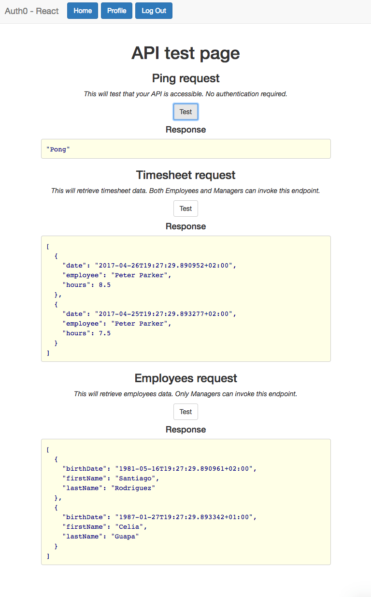

# Introduction

The following sample consists of:

* A **.NET Core API** with several endpoints: Some of them do not require authorization and others require authorization via a JWT bearer token.
* A **React.js Single Page Application** which allows the user to login, display user profile information and test the API based on the permissions granted via the Authorization Extension from Auth0.



# Auth0 Configuration

## APIs

Create a new API using the following parameters:

* Name: `Corporate API`
* Identifier: `http://localhost:3636`
* Signing Algorithm: `RS256`

Add the following scopes:

* `create:employees`
* `read:employees`
* `create:timesheets`
* `read:timesheets`

## Client

Create a new SPA client (React)

* Name: `My corporate portal`
* Allowed Callback URLs: `http://localhost:3000/callback`
* Assign connections to client!

## Authorization Extension

Add the following permissions to the application `My corporate portal`:

* `create:employees`
* `read:employees`
* `create:timesheets`
* `read:timesheets`

Add the following roles to the application `My corporate portal`:

* Role name: `Manager`, scopes: Select ALL
* Role name: `Employee`, scopes: `create:timesheets`, `read:timesheets`

Configure the extension to add permissions to the Token:
1. Authorization Extension => Configuration => Permissions
2. Click on **Publish Rule**

Go to the users section and select two of your users:
1. Assign the role `Manager` to one of your users
2. Assing the role `Employee` to another user

## Custom rule

Add a new rule which should be executed after the authorization extension rule with the following code:

```javascript
function (user, context, callback) {
  if (context.clientName !== 'My corporate portal') {
    return callback(null, user, context);
  }
  
  var permissions = user.permissions || [];
  var requestedScopes = context.request.body.scope || context.request.query.scope;
  var filteredScopes = requestedScopes.split(' ').filter( function(x) {
    return x.indexOf(':') < 0;
  });
  Array.prototype.push.apply(filteredScopes, permissions);
  context.accessToken.scope = filteredScopes.join(' ');

  callback(null, user, context);
}
```

This will overwrite the `access_token` scopes with the scopes from the authorization extension.

# Testing
## API
In the `api` directory update the `appsettings.json` with your Auth0 settings:

```json
{
  "Auth0": {
    "Domain": "Your Auth0 domain",
    "ApiIdentifier": "http://localhost:3636"
  } 
}
```

Then restore the NuGet packages and run the API:

```bash
# Install the dependencies
dotnet restore

# Run
dotnet run
```

## SPA
In the directory `spa/src/Auth` copy the file `auth0-variables.js.example`
to `auth0-variables.js` and update it with the settings from your SPA client:

export const AUTH_CONFIG = {
  domain: {DOMAIN},
  clientId: {CLIENT_ID},
  callbackUrl: 'http://localhost:3000/callback'
}

Then restore the node modules and run the application:

```bash
# Install the dependencies
npm install

# Run
npm start
```

## Go!
Navigate to http://localhost:3000 and compare the API call results after signing in with your two differnet users from the authentication extension.
